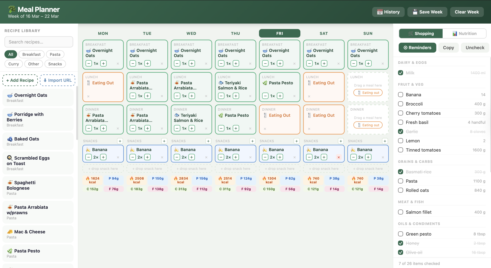

# Meal Planner

A self-contained, single-file weekly meal planner. No install, no server, no account — just open `index.html` in any browser.

---

## Screenshot




## Getting Started

1. Download or clone the repository.
2. Open `index.html` in your browser.
3. That's it. Everything runs locally and is saved in your browser's `localStorage`.

---

## How to Use

### Planning your week

The centre panel shows a 7-day calendar with **Breakfast**, **Lunch**, **Dinner**, and **Snacks** slots for each day.

- **Drag a recipe** from the left sidebar and drop it into any meal slot.
- Click **"Eating out"** inside an empty slot to mark that meal as eating out instead.
- Use the **−** / **+** buttons on a filled slot to adjust serving count (useful for batch cooking).
- Click the meal name in a slot to view the full recipe.
- Click **✕** on a slot to clear it.

### Snacks

Each day has an expandable snack section. Click **+** next to "Snacks" to add a snack slot, then drag any recipe tagged as a snack into it.

### Shopping list

The right panel auto-generates a grouped shopping list from everything in your weekly plan. Ingredient quantities scale with serving count.

- **Copy** — copies the list to your clipboard.
- **Uncheck** — resets all ticked items.
- **Reminders** — generates an AppleScript you can run in Script Editor to push the list directly into Apple Reminders.

### Nutrition tracking

Switch to the **Nutrition** tab (top of the right panel) to see a macro breakdown (calories, protein, carbs, fat, fibre) by day and as a weekly total.

### Saving and history

- Your plan auto-saves as you make changes.
- Click **Save Week** in the header to take a named snapshot.
- Click **History** to browse, restore, or delete past weeks.

---

## Adding Recipes

### In the app (recommended)

1. Click **+ Add Recipe** in the left sidebar.
2. Fill in the emoji, name, and category.
3. Add ingredients with amounts and units.
4. Optionally click **Auto-calc** to fetch estimated macros from the USDA FoodData database.
5. Write instructions — each line becomes a numbered step.
6. Click **Save Recipe**. Your recipe is saved to `localStorage` and appears immediately.

Recipes you add in the app persist across sessions in that browser. To share them, use **Export / Import** (see below).

### Editing or deleting a recipe

Hover over a recipe card in the sidebar — edit (✏) and delete (🗑) buttons appear. You can also click **Edit Recipe** from the recipe detail view.

### Importing from a URL

Click **Import URL** in the sidebar to fetch a recipe from any website that uses [Schema.org Recipe markup](https://schema.org/Recipe). Works well with BBC Good Food, Allrecipes, Serious Eats, Jamie Oliver, Yotam Ottolenghi, NYT Cooking, Tasty, and many others.

---

## Contributing Recipes to the Default List

The built-in recipes are defined as a plain JavaScript array near the top of `index.html`, starting at the line:

```js
const RECIPES = [
```

To add a recipe to the default list that ships with the app, add an object to that array following this structure:

```js
{
  id: 'my-recipe',              // unique kebab-case string, no spaces
  name: 'My Recipe',            // display name
  category: 'other',            // breakfast | pasta | curry | other | snack
  emoji: '🍽',                  // single emoji
  nutrition: {
    calories: 500,              // per serving
    protein: 30,                // grams
    carbs: 60,                  // grams
    fat: 15,                    // grams
    fibre: 5,                   // grams
  },
  ingredients: [
    { name: 'Ingredient name', amount: 200, unit: 'g' },
    { name: 'Another ingredient', amount: 2, unit: 'tbsp' },
    // leave unit as '' for unitless items (e.g. eggs, bananas)
  ],
  instructions: `Step one goes here.
Step two goes here.
Step three goes here.`
  // Each line in the template literal becomes a numbered step.
}
```

**Guidelines for contributed recipes:**

- Use a unique `id` — if two recipes share an `id`, only the first will appear.
- Ingredients should be **per serving** (the app scales quantities automatically when the serving count is adjusted).
- Nutrition values are optional but recommended — leave them as `0` if unknown.
- Instructions should be written as concise numbered steps, one per line.
- Keep categories consistent: `breakfast`, `pasta`, `curry`, `other`, or `snack`.

Once added, open a pull request with a short description of the recipe and its source/origin if applicable.

---

## Data & Privacy

All data (your weekly plan, saved weeks, custom recipes) is stored entirely in your browser's `localStorage`. Nothing is sent to any server. The only external request the app makes is to the [USDA FoodData Central API](https://fdc.nal.usda.gov/) when you use the **Auto-calc** button to look up nutrition data, using the public demo key.
